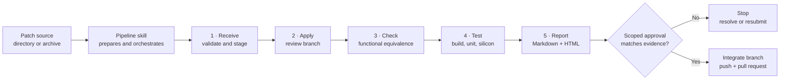
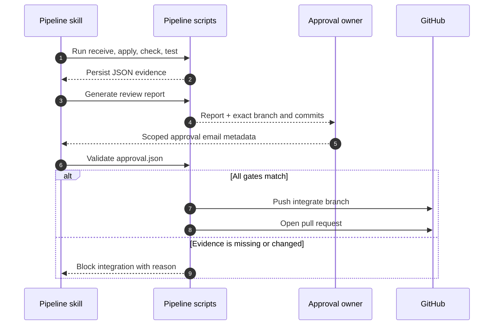
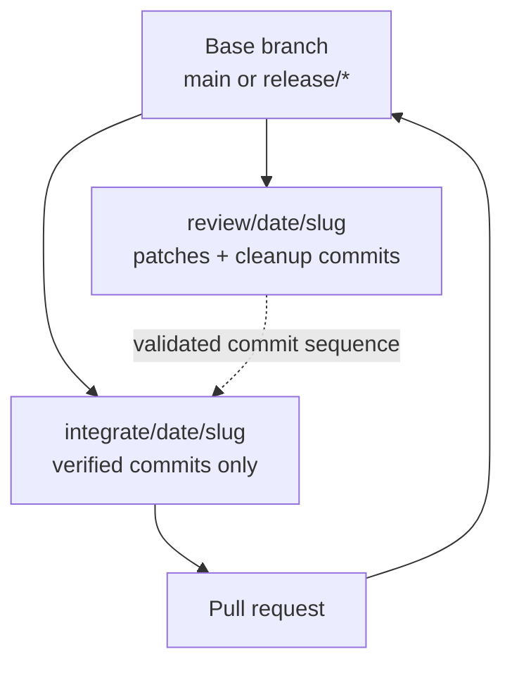

<div align="center">

# Patch Pipeline

**A skill-driven, fail-closed workflow for reviewing and integrating external patches**

[中文](README_CN.md) · [Branching strategy](BRANCHING_STRATEGY.md) · [Pipeline skill](skills/public/bios-patch-pipeline/SKILL.md)

`Python 3.10+` · `Git` · `Linux/macOS shell`

</div>

---

## Why this exists

External patches often arrive from a repository that has already diverged from the receiver. A patch applying cleanly does not prove that the sender's intent survived the adaptation.

Patch Pipeline separates **mechanical execution** from **human authorization**:

- A skill is the primary interface and orchestrates the workflow.
- Python or Bash scripts produce deterministic, compatible JSON evidence.
- Integration of the accepted staged set fails closed unless application, equivalence, tests, and approval all satisfy their gates.
- Human input is limited to genuine conflicts and a scoped approval decision.

> [!IMPORTANT]
> An email saying `LGTM` is not enough by itself. Approval must identify the exact report, review branch, and ordered commit list.

## Workflow at a glance



### Gate model

| Gate | Pass condition | On failure |
|---|---|---|
| Intake | Every submitted patch is valid and accepted | Correct the rejected files and rerun receive before continuing |
| Apply | Every accepted patch applied; no unresolved conflict | Stop on the review branch |
| Equivalence | Every file is `MATCH`; no `PARTIAL`, `MISMATCH`, `MISSING`, or `EXTRA` | Require review or patch correction |
| Automated tests | Build and unit tests are `PASS` or `SKIPPED` | `FAIL`, `TIMEOUT`, and `ERROR` block integration |
| Silicon test | Result is recorded as `PASS`, `FAIL`, `PENDING`, or `SKIPPED` | `FAIL` blocks; other states remain visible to the approver |
| Approval | Email metadata matches the report hash, branch, and full ordered commit list | Block integration |

## Quick start

### 1. Install

Python 3.11+ includes `tomllib`. Python 3.10 is supported through the `tomli` backport in the development requirements.

```bash
python -m pip install -r requirements-dev.txt
```

### 2. Configure

Create `.patch-pipeline.toml` in the target repository:

```toml
release = "bhs_pb2_35d44"
base_branch = "release/bhs_pb2_35d44"
build_command = "make -j4"
unit_test_command = "pytest tests/"
test_timeout_seconds = 600
```

Environment variables override TOML values, for example:

```bash
export PATCH_PIPELINE_BASE_BRANCH="release/bhs_pb2_35d44"
export PATCH_PIPELINE_TEST_TIMEOUT_SECONDS=900
```

### 3. Run through the skill

Ask the `bios-patch-pipeline` skill to process the patch source and target repository. The skill handles archive preparation and real-world patch cleanup, then delegates deterministic steps to the scripts below.

<details>
<summary><strong>Direct script commands</strong></summary>

```bash
DATE=2026-09-15
PATCH_DIR=/mnt/shared-patches/release-name/$DATE
TARGET_REPO=/path/to/target-repo

python python/patch_receive.py "$PATCH_DIR" --repo "$TARGET_REPO" --date "$DATE" --no-prompt
python python/patch_apply.py --repo "$TARGET_REPO" --date "$DATE"
python python/patch_check.py --repo "$TARGET_REPO" --date "$DATE"
python python/patch_test.py --repo "$TARGET_REPO" --date "$DATE" --no-prompt --silicon-result PENDING
python python/patch_report.py --repo "$TARGET_REPO" --date "$DATE"
python python/patch_integrate.py --repo "$TARGET_REPO" --date "$DATE" --approval-file /path/to/approval.json
```

Receive, apply, check, test, and integrate have Bash alternatives under `bash/`; report generation is Python-only. Both execution paths produce compatible staging data.

</details>

## The five stages

### 1. Receive and validate

```bash
python python/patch_receive.py /path/to/patches --repo "$TARGET_REPO" --date "$DATE" --no-prompt
```

Validates `git format-patch` structure, patch size, binary extensions, and configured path prefixes. Valid patches and `review_data.json` are copied into `.patch-staging/<date>/`.

If any submitted patch is rejected, correct the bundle and rerun receive before continuing; later evidence covers only accepted patches. Use `--force` only to replace the **entire** date session. This prevents stale patches or evidence from being reused.

### 2. Apply on a review branch

```bash
python python/patch_apply.py --repo "$TARGET_REPO" --date "$DATE"
```

Creates `review/<date>/<slug>` from the configured base and applies the series with `git am --3way`. The immutable base commit and full applied commit hashes are recorded in `apply_data.json`.

### 3. Check functional equivalence

```bash
python python/patch_check.py --repo "$TARGET_REPO" --date "$DATE"
```

Compares the sender's patch with the receiver's actual branch diff:

| Result | Meaning | Integration |
|---|---|---|
| `MATCH` | At least 75% similarity; intended change is present | Allowed |
| `PARTIAL` | 40–75% similarity | Blocked |
| `MISMATCH` | Below 40% similarity | Blocked |
| `MISSING` | Sender changed a file; receiver did not | Blocked |
| `EXTRA` | Receiver changed a file absent from the patch | Blocked |

The overall result is `PASS` only when **every** file is `MATCH`.

### 4. Run tests

```bash
python python/patch_test.py --repo "$TARGET_REPO" --date "$DATE" --no-prompt --silicon-result PENDING
```

Runs configured build and unit-test commands with a timeout. An empty command is recorded as `SKIPPED` and remains visible to the approval owner; configure both commands when validation is required. Noninteractive runs record silicon testing as `PENDING` unless an explicit result is supplied.

### 5. Report, approve, and integrate

```bash
python python/patch_report.py --repo "$TARGET_REPO" --date "$DATE"
python python/patch_integrate.py --repo "$TARGET_REPO" --date "$DATE" --approval-file /path/to/approval.json
```

The report is generated as both `REVIEW_REPORT.md` and `REVIEW_REPORT.html`. Integration creates `integrate/<date>/<slug>` from the recorded base branch, cherry-picks every reviewed commit, pushes the branch, and opens a pull request through `gh`.



The approval record must use this shape:

```json
{
  "decision": "APPROVED",
  "approval_type": "email",
  "message_id": "<mail-message-id>",
  "sender": "sender@example.com",
  "approved_at": "2026-09-15T15:00:00+08:00",
  "review_branch": "review/2026-09-15/fix-timing",
  "commit_shas": ["<full-40-character-commit-sha>"],
  "report_file": "REVIEW_REPORT.html",
  "report_sha256": "<64-character-sha256>"
}
```

After validation, the pipeline writes the verified provenance to `approval_data.json`.

## Evidence and branch model



| Artifact | Produced by | Purpose |
|---|---|---|
| `review_data.json` | Receive | Patch metadata, warnings, notes |
| `apply_data.json` | Apply | Base commit, review branch, applied commits |
| `check_data.json` | Check | Per-file equivalence and strict overall result |
| `test_data.json` | Test | Build, unit, and silicon results |
| `REVIEW_REPORT.md/.html` | Report | Human-readable review package |
| `approval_data.json` | Integrate gate | Verified approval provenance |
| `integrate_data.json` | Integrate | Integration branch and pull-request result |

## Repository map

```text
patch-pipeline/
├── python/                  # Primary deterministic implementation
│   ├── approval.py         # Fail-closed evidence and approval validator
│   ├── config.py           # TOML and environment configuration
│   ├── patch_*.py          # Five workflow stages
│   └── utils.py            # Git, schema, and patch helpers
├── bash/                    # Compatible shell entry points
├── skills/public/
│   └── bios-patch-pipeline # Human-facing orchestration
├── tests/                   # Unit and git-backed workflow tests
├── README.md
└── README_CN.md
```

## Troubleshooting

| Symptom | Action |
|---|---|
| `git am` conflict | Resolve and stage files with `git add`, then run `git am --continue`. The saved apply evidence remains incomplete; prepare a corrected patch set, abort/delete the review branch, and rerun apply before integration. |
| Equivalence is not `PASS` | Inspect the per-file result; correct or explicitly resubmit the patch. |
| Build/unit test is `FAIL`, `TIMEOUT`, or `ERROR` | Fix the failure and rerun the test stage. |
| Approval is rejected | Regenerate approval metadata for the exact report hash and current commit list. |
| `gh pr create` fails | Authenticate with `gh auth login`, then run the printed command. |
| Old evidence remains | Rerun receive with `--force` to replace the complete date session. |

## Development

```bash
python -m pytest tests/ -v
python -m py_compile python/*.py
bash -n bash/*.sh
```
