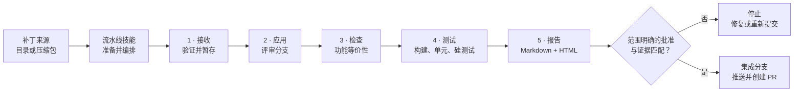
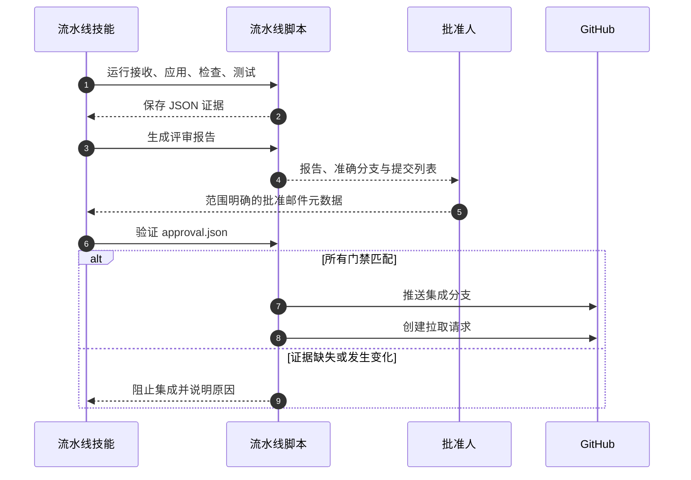
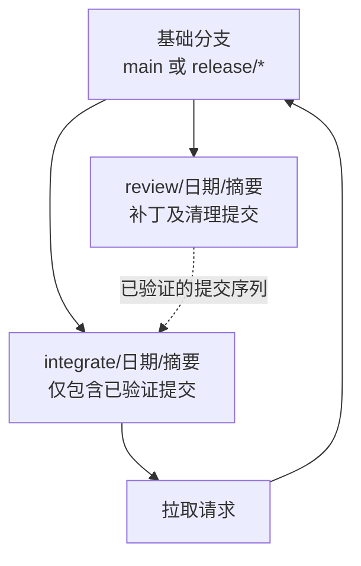

<div align="center">

# 补丁审查流水线

**以技能为入口、默认失败即停止的外部补丁审查与集成流程**

[English](README.md) · [分支策略](BRANCHING_STRATEGY_CN.md) · [流水线技能](skills/public/bios-patch-pipeline/SKILL.md)

`Python 3.10+` · `Git` · `Linux/macOS shell`

</div>

---

## 为什么需要它

外部补丁通常来自已经与接收方发生分歧的代码库。补丁能够干净应用，并不能证明发送方的修改意图在适配后仍然完整保留。

补丁审查流水线将**机械执行**与**人工授权**分开：

- 技能是主要入口，负责组织完整流程。
- Python 或 Bash 脚本生成确定性且相互兼容的 JSON 证据。
- 对已接受暂存集合的集成，只有在应用、等价性、测试和批准全部满足门禁时才会继续。
- 人工仅需处理真正的冲突，并提供范围明确的批准决定。

> [!IMPORTANT]
> 单独一封写有 `LGTM` 的邮件并不足以批准集成。批准记录必须绑定准确的报告、评审分支和有序提交列表。

## 流程总览



### 门禁模型

| 门禁 | 通过条件 | 失败处理 |
|---|---|---|
| 接收 | 所有提交的补丁均有效并已接受 | 修正被拒绝的文件，并重新执行接收后再继续 |
| 应用 | 所有已接受补丁均已应用，且没有未解决冲突 | 停留在评审分支 |
| 等价性 | 所有文件均为 `MATCH`；没有 `PARTIAL`、`MISMATCH`、`MISSING` 或 `EXTRA` | 要求审查或修正补丁 |
| 自动化测试 | 构建和单元测试为 `PASS` 或 `SKIPPED` | `FAIL`、`TIMEOUT` 和 `ERROR` 阻止集成 |
| 硅测试 | 已记录 `PASS`、`FAIL`、`PENDING` 或 `SKIPPED` | `FAIL` 阻止集成；其他状态对批准人可见 |
| 批准 | 邮件元数据与报告哈希、分支及完整有序提交列表一致 | 阻止集成 |

## 快速开始

### 1. 安装

Python 3.11+ 内置 `tomllib`。Python 3.10 通过开发依赖中的 `tomli` 后备库获得支持。

```bash
python -m pip install -r requirements-dev.txt
```

### 2. 配置

在目标仓库中创建 `.patch-pipeline.toml`：

```toml
release = "bhs_pb2_35d44"
base_branch = "release/bhs_pb2_35d44"
build_command = "make -j4"
unit_test_command = "pytest tests/"
test_timeout_seconds = 600
```

环境变量的优先级高于 TOML，例如：

```bash
export PATCH_PIPELINE_BASE_BRANCH="release/bhs_pb2_35d44"
export PATCH_PIPELINE_TEST_TIMEOUT_SECONDS=900
```

### 3. 通过技能运行

让 `bios-patch-pipeline` 技能处理补丁来源和目标仓库。技能负责压缩包准备与真实场景下的补丁清理，然后调用以下脚本完成确定性步骤。

<details>
<summary><strong>直接运行脚本</strong></summary>

```bash
DATE=2026-09-15
PATCH_DIR=/mnt/shared-patches/release-name/$DATE
TARGET_REPO=/path/to/target-repo

python python/patch_receive.py "$PATCH_DIR" --repo "$TARGET_REPO" --date "$DATE" --no-prompt
python python/patch_apply.py --repo "$TARGET_REPO" --date "$DATE"
python python/patch_check.py --repo "$TARGET_REPO" --date "$DATE"
python python/patch_test.py --repo "$TARGET_REPO" --date "$DATE" --no-prompt --silicon-result PENDING
python python/patch_report.py --repo "$TARGET_REPO" --date "$DATE"
python python/patch_integrate.py --repo "$TARGET_REPO" --date "$DATE" --approval-file /path/to/approval.json
```

接收、应用、检查、测试和集成在 `bash/` 下有对应入口；报告生成仅提供 Python 实现。两条执行路径生成兼容的暂存数据。

</details>

## 五个阶段

### 1. 接收并验证

```bash
python python/patch_receive.py /path/to/patches --repo "$TARGET_REPO" --date "$DATE" --no-prompt
```

检查 `git format-patch` 结构、补丁大小、二进制扩展名和已配置的路径前缀。有效补丁及 `review_data.json` 会被复制到 `.patch-staging/<日期>/`。

如果有任何提交的补丁被拒绝，请先修正补丁包并重新执行接收；后续证据仅覆盖已接受的补丁。仅在需要替换**整个**日期会话时使用 `--force`，以避免复用旧补丁或旧证据。

### 2. 应用到评审分支

```bash
python python/patch_apply.py --repo "$TARGET_REPO" --date "$DATE"
```

从已配置的基础分支创建 `review/<日期>/<摘要>`，并通过 `git am --3way` 应用补丁。不可变的基础提交及完整应用提交哈希会记录到 `apply_data.json`。

### 3. 检查功能等价性

```bash
python python/patch_check.py --repo "$TARGET_REPO" --date "$DATE"
```

比较发送方补丁与接收方评审分支的实际差异：

| 结果 | 含义 | 是否允许集成 |
|---|---|---|
| `MATCH` | 相似度至少为 75%，预期变更已存在 | 允许 |
| `PARTIAL` | 相似度为 40–75% | 阻止 |
| `MISMATCH` | 相似度低于 40% | 阻止 |
| `MISSING` | 发送方修改了文件，接收方没有对应变更 | 阻止 |
| `EXTRA` | 接收方修改了补丁未涉及的文件 | 阻止 |

只有**每个**文件都是 `MATCH` 时，整体结果才是 `PASS`。

### 4. 运行测试

```bash
python python/patch_test.py --repo "$TARGET_REPO" --date "$DATE" --no-prompt --silicon-result PENDING
```

在超时限制内运行已配置的构建和单元测试命令。空命令会记录为 `SKIPPED` 并对批准人保持可见；需要执行验证时应配置这两个命令。非交互执行如果没有显式传入硅测试结果，会记录为 `PENDING`。

### 5. 生成报告、批准并集成

```bash
python python/patch_report.py --repo "$TARGET_REPO" --date "$DATE"
python python/patch_integrate.py --repo "$TARGET_REPO" --date "$DATE" --approval-file /path/to/approval.json
```

报告同时生成 `REVIEW_REPORT.md` 和 `REVIEW_REPORT.html`。集成步骤从已记录的基础分支创建 `integrate/<日期>/<摘要>`，依次挑选所有已评审提交，推送分支，并通过 `gh` 创建拉取请求。



批准记录必须符合以下结构：

```json
{
  "decision": "APPROVED",
  "approval_type": "email",
  "message_id": "<邮件消息 ID>",
  "sender": "sender@example.com",
  "approved_at": "2026-09-15T15:00:00+08:00",
  "review_branch": "review/2026-09-15/fix-timing",
  "commit_shas": ["<完整的 40 位提交 SHA>"],
  "report_file": "REVIEW_REPORT.html",
  "report_sha256": "<64 位 SHA-256>"
}
```

验证通过后，流水线会将已验证的来源信息写入 `approval_data.json`。

## 证据与分支模型



| 产物 | 生成阶段 | 用途 |
|---|---|---|
| `review_data.json` | 接收 | 补丁元数据、警告和备注 |
| `apply_data.json` | 应用 | 基础提交、评审分支和已应用提交 |
| `check_data.json` | 检查 | 每个文件的等价性及严格的整体结果 |
| `test_data.json` | 测试 | 构建、单元和硅测试结果 |
| `REVIEW_REPORT.md/.html` | 报告 | 供人工阅读的评审包 |
| `approval_data.json` | 集成门禁 | 已验证的批准来源 |
| `integrate_data.json` | 集成 | 集成分支和拉取请求结果 |

## 仓库结构

```text
patch-pipeline/
├── python/                  # 主要的确定性实现
│   ├── approval.py         # 默认失败即停止的证据和批准验证器
│   ├── config.py           # TOML 和环境变量配置
│   ├── patch_*.py          # 五个工作流阶段
│   └── utils.py            # Git、数据结构和补丁辅助函数
├── bash/                    # 兼容的 Shell 入口
├── skills/public/
│   └── bios-patch-pipeline # 面向用户的编排层
├── tests/                   # 单元测试和基于 Git 的流程测试
├── README.md
└── README_CN.md
```

## 故障排查

| 现象 | 处理方法 |
|---|---|
| `git am` 冲突 | 修复文件并使用 `git add` 暂存，然后运行 `git am --continue`。已保存的应用证据仍不完整；集成前应准备修正后的补丁集，中止并删除评审分支，再重新执行应用。 |
| 等价性结果不是 `PASS` | 查看每个文件的结果；修正补丁或明确重新提交。 |
| 构建/单元测试为 `FAIL`、`TIMEOUT` 或 `ERROR` | 修复失败原因并重新运行测试阶段。 |
| 批准被拒绝 | 针对准确的报告哈希和当前提交列表重新生成批准元数据。 |
| `gh pr create` 失败 | 使用 `gh auth login` 完成认证，再运行脚本输出的命令。 |
| 仍存在旧证据 | 使用 `--force` 重新接收，以替换整个日期会话。 |

## 开发与验证

```bash
python -m pytest tests/ -v
python -m py_compile python/*.py
bash -n bash/*.sh
```
